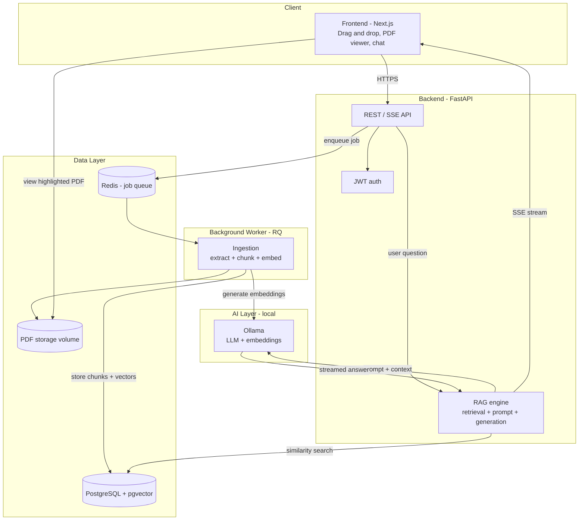

# RAG Semantic Search Platform

A fully local, self-hosted **Retrieval-Augmented Generation (RAG)** platform for semantic search and summarization of technical documents. Upload PDFs, ask questions in natural language, and get answers grounded **strictly** in your documents — with the exact source passages highlighted in an integrated PDF viewer.

No external APIs. No data leaves your machine. Everything runs locally and for free.

> **Status:** Active development. Core pipeline (upload → process → ask → cite) is complete and runs end-to-end via Docker Compose.

---

## Why this project

Most "chat with your PDF" demos are thin wrappers around a paid cloud API, sending your documents to a third party. This project is different: it is a complete, production-shaped knowledge-management application where the entire stack — including the language model and embeddings — runs on your own hardware through [Ollama](https://ollama.com). It is built to be read, cloned, and extended.

---

## Features

- **Drag & drop document upload** with real-time processing status.
- **Asynchronous ingestion pipeline** — large PDFs are processed in a background worker without blocking the API.
- **Block-level source highlighting** — answers cite the exact text blocks they came from, highlighted directly on the rendered PDF.
- **Streaming chat responses** — answers appear token by token as the model generates them.
- **Conversation memory** — follow-up questions ("now explain that") resolve correctly against previous turns.
- **Strictly grounded answers** — the model is instructed to answer only from retrieved context and to say so when the answer isn't in the documents.
- **JWT authentication** — each user only sees and queries their own documents.
- **100% local & free** — no OpenAI, no Pinecone, no Auth0. Self-hosted from top to bottom.

---

## Architecture



**How RAG works here:** an uploaded PDF is split into overlapping text chunks (each tagged with its page and bounding boxes). Each chunk is embedded via Ollama and stored in `pgvector`. When you ask a question, it is embedded too, the most similar chunks are retrieved by cosine distance, and those chunks are injected into the prompt sent to the local LLM — which answers using only that context and cites the source pages.

---

## Tech stack

### Frontend
- **Next.js 16** (React 19, TypeScript, App Router)
- **TailwindCSS** + **shadcn/ui** for styling and components
- **TanStack Query** for server state and polling
- **Zustand** for client state (auth)
- **react-dropzone** for file upload
- **react-pdf** (pdf.js) for the document viewer and highlight overlay

### Backend
- **Python 3.13** + **FastAPI** (async, auto-generated OpenAPI docs)
- **SQLAlchemy 2.0** + **Alembic** for ORM and versioned migrations
- **Pydantic v2** for validation and settings
- **PyMuPDF** for PDF text + bounding-box extraction
- **LangChain text splitters** for intelligent chunking
- **pwdlib** (Argon2) + **PyJWT** for authentication
- **RQ** (Redis Queue) for background document processing

### AI / RAG (fully local)
- **Ollama** as the local inference server
- **`llama3.1:8b`** for generation
- **`nomic-embed-text`** for embeddings (768 dimensions)

### Data & infrastructure
- **PostgreSQL 18** with the **pgvector** extension (relational + vector store in one)
- **Redis** for the job queue
- **Docker** + **Docker Compose** for orchestration

---

## Getting started

### Prerequisites

- [Docker Desktop](https://www.docker.com/products/docker-desktop/) (with Docker Compose)
- [Ollama](https://ollama.com/download) installed and running on your host machine
- ~8 GB RAM minimum (16 GB or a 6–8 GB GPU recommended for comfortable LLM speed)

### 1. Pull the Ollama models

Ollama runs on your host (not in a container) so it can access your GPU directly. Pull the two models the platform uses:

```bash
ollama pull llama3.1:8b
ollama pull nomic-embed-text
```

Make sure Ollama is running (it serves on `http://localhost:11434` by default).

### 2. Clone and configure

```bash
git clone https://github.com/<your-username>/rag-platform.git
cd rag-platform
cp .env.example .env
```

Open `.env` and set a real `SECRET_KEY` (generate one with `python -c "import secrets; print(secrets.token_hex(32))"`) and change the default password.

### 3. Launch the whole stack

```bash
docker compose up --build
```

This starts five services: the Next.js frontend, the FastAPI backend, the RQ worker, PostgreSQL (with pgvector), and Redis. Database migrations run automatically on startup.

### 4. Use it

Open **http://localhost:3000**, register an account, upload a PDF, wait for it to reach the **Ready** status, then open it and start asking questions.

---

## Project structure

```
rag-platform/
├── frontend/                 # Next.js application
│   ├── app/                  # routes (login, register, dashboard, document view)
│   ├── components/           # UI, chat, document, and provider components
│   ├── lib/                  # API client and per-domain API functions
│   ├── stores/               # Zustand auth store
│   └── types/                # shared TypeScript types
├── backend/                  # FastAPI application
│   ├── app/
│   │   ├── api/              # routers (auth, documents, chat) + dependencies
│   │   ├── core/             # config, database, security, queue
│   │   ├── models/           # SQLAlchemy models
│   │   ├── schemas/          # Pydantic schemas
│   │   ├── services/         # ingestion, embeddings, retrieval, RAG
│   │   └── worker.py         # RQ worker entry point
│   └── alembic/              # database migrations
├── docker-compose.yml        # full stack orchestration
└── .env.example              # environment variable template
```

---

## Configuration

All configuration is done through environment variables (see `.env.example`):

| Variable | Description | Default |
|---|---|---|
| `POSTGRES_DB` / `POSTGRES_USER` / `POSTGRES_PASSWORD` | Database credentials | `ragdb` / `raguser` / — |
| `SECRET_KEY` | Secret used to sign JWTs (set your own!) | — |
| `ACCESS_TOKEN_EXPIRE_MINUTES` | JWT lifetime | `60` |
| `EMBEDDING_MODEL` | Ollama embedding model | `nomic-embed-text` |
| `LLM_MODEL` | Ollama generation model | `llama3.1:8b` |
| `TOP_K_CHUNKS` | Number of chunks retrieved per question | `5` |

If your hardware allows it, you can swap `LLM_MODEL` for a larger model (for example `mistral-small:22b` or `qwen3:14b`) for higher answer quality — just `ollama pull` it first.

---

## Roadmap

- [x] Document upload and async ingestion pipeline
- [x] Vector retrieval with pgvector + RAG engine
- [x] Streaming chat with conversation memory
- [x] PDF viewer with block-level source highlighting
- [x] Full Docker Compose deployment
- [ ] Automated test suite (backend + frontend) and CI pipeline
- [ ] RAG quality evaluation (faithfulness / relevance metrics)
- [ ] Re-ranking of retrieved chunks
- [ ] Hybrid search (full-text + vector)
- [ ] Multi-document filtering and project organization

---

## Contributing

Contributions, issues, and feature requests are welcome. Feel free to fork the repository, open an issue, or submit a pull request.

---

## License

This project is licensed under the MIT License — see the [LICENSE](LICENSE) file for details. You are free to use, copy, modify, and distribute it, including for commercial purposes, as long as the copyright notice is retained.
